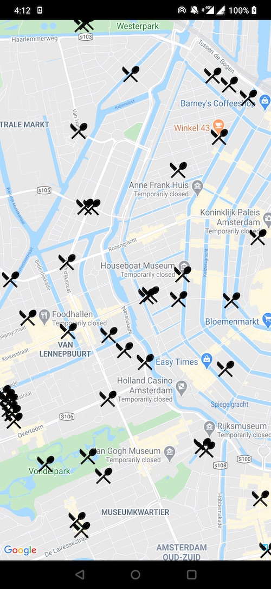
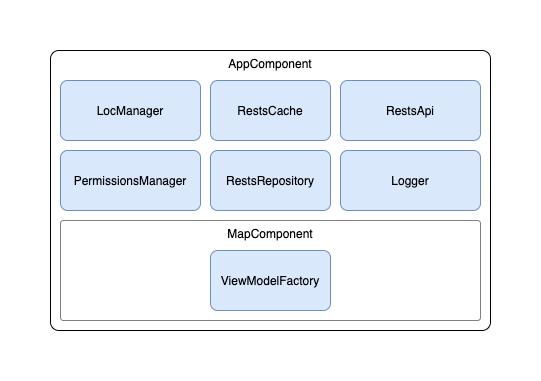
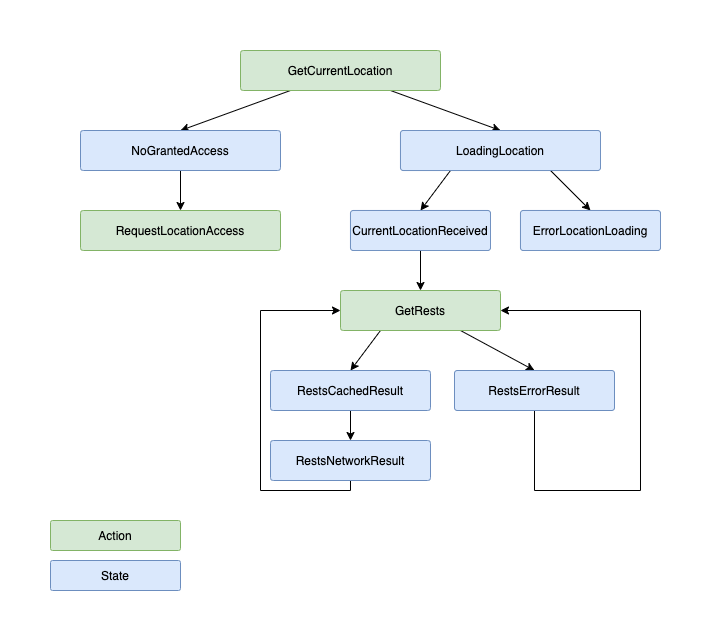

# Setup
1. create file `./foursquare.api.config` with [FourSquare](https://developer.foursquare.com/) api configuration values:
```
client.id=
client.secret=
```
2. create file `./google.api.config` with [Android Google Maps](https://console.developers.google.com/flows/enableapi?apiid=maps_android_backend):
```
maps.key=
```
# Build
```shell script
./gradlew assembleDebug
```
# Install
```shell script
adb install app/build/outputs/apk/debug/app-debug.apk
```
# Package structure
- `com.elevenetc.android.resta.core`: common code
- `com.elevenetc.android.resta.features`: set of features
- `com.elevenetc.android.resta.features.view`: view related code
- `com.elevenetc.android.resta.features.vm`: view models
- `com.elevenetc.android.resta.features.api`: api related code

# Done
- map of restaurants
- viewport loading
- in-memory cache
- cached data becomes visible first

# Can be improved
- add tests
- better UI error handling

# Dependencies and components structure



# Rests map states flow (basic)


